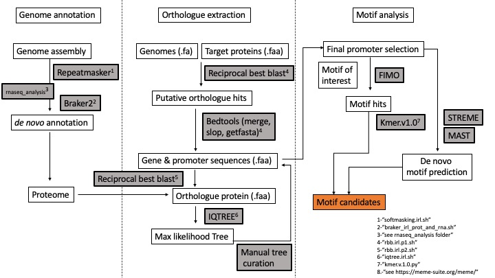

# ENSA

<This repository contains the scripts used for the ENSA project.>

The pipeline I developed is illustrated here: 

There are 4 main folders where the scripts reside: 
- genome_annotation
- orthologue_finder
- motif_prediction
- rnaseq_analysis

<Genome_annotation>

This folder has the scripts used for the *de novo* annotation of the genomes. 
- "softmasking.irl.sh" Uses RepeatModeler and RepeatClassifier for masking genomes
- "braker_aw" Test script for braker2 developed by AnneW.
- "braker_irl_prot_and_rna.sh" modified version of anne's for running braker2 on proteins and RNAseq data.
- "busco.irl.sh"  Code for running busco.
- "ncbi_dataset.py"  Code for downloading bulk assemblies from ncbi.
- "softmasking.irl.sh" Code for softmasking genomes.

<orthologue_finder>
This folder has the scripts used for the *de novo* annotation of the genomes. 
- "rbb.irl.v1.2.sh" Reciprocal best blast for retreiving potential orthologues and their promoter sequences
- "rbb.irl.vprot3.sh"
- "rbb.irl.vprot4.sh"
- "rbb.process.sh"
- "iqtree"

<motif_prediction> 
This folder has some of the scripts used for analysing motif data. 

<rnaseq_analysis> 
This folder has the scripts used for analyzing RNAseq data. 

- "rnaseq_trim_fastqc.irl.v2.sh" Script for FASTQC and trimming RNAseq samples. 
- "rnaseq_hisatindex.v2.sh" After running rnaseq_trim_fastqc.irl.v2.sh run this script to create a hisat index before aligning.
- "rnaseq_align_forbraker.irl.sh" Script for aligning RNAseq data and generate *.bam files for braker. 
- "bamcoverage.irl.sh" File to visualize coverage from RNAseq data. This is useful when using a genome browser software to manually annotate genes. 
- rnaseq_course_preprocess "Script from the RNASEQ course to FASTQC data for RNAseq analysis"
- rnaseq_course_preprocess_and_quantification.sh "Script from the RNASEQ course to FASTQC and quantification for RNAseq analysis" 
